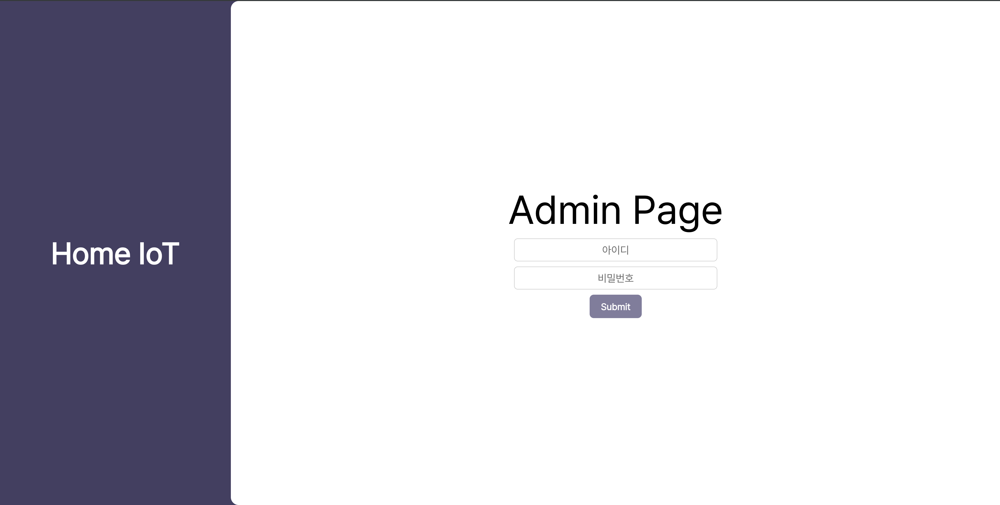

# 📊HOME IoT 어드민 페이지 (FRONT-END)

## Demo

Design: [Figma Link](https://www.figma.com/design/7alBwBGWoQmzbtYA2Cuyd9/Home-IoT-%EC%9B%B9%ED%8E%98%EC%9D%B4%EC%A7%80?node-id=0-1&t=upcgX2eDgGaTdXEg-1)

## Environment
* OS    : MacOS
* SKILL : 
    - LANGUAGE &ensp;: NodeJS, JAVASCRIPT
    - LIBRARY &emsp; &ensp;: REACTJS, AXIOS, Crypto-JS
    - DOCS &emsp; &emsp; &ensp;: HTML5, CSS3
    - DB &emsp; &emsp; &emsp; &ensp; : MariaDB
* Tools : Figma, VSCode

## Description
나만의 스마트홈을 구축하기 위한 프로젝트 HOME IoT의 데이터를 관리하기 위한 어드민 페이지

 **대시보드 페이지** : 전체 데이터 모니터링 페이지  
 **사용자 관리 페이지** : 사용자 관리를 위한 페이지  
 **세부 데이터 페이지** : 센서, 구동기 등 데이터 분석 페이지 
 **장치 관리 페이지** : 신규 장치 추가, 기존 장비 수정, 단종 장비 삭제 등 관리 페이지  
 **보고서 페이지** : 장비 오류, 사용량, 성능 분석을 위한 보고서 페이지 
 **로그 페이지** : 장비 오류 로그 페이지 

## Development Period
* 전체기간 : 2025.03.31(월) ~ 진행 중
* 소프트웨어 설계 : 2025.03.24 ~ 2025.03.28
    * 데이터베이스 설계 &emsp;: 2025.03.24 ~ 2025.03.26
    * 페이지 디자인 &emsp; &emsp;&ensp;: 2025.03.25 ~ 2025.03.28

## Member
* PM: 강동성 
* Server: 강동성 
* WEB Front: 강동성 
* UI/UX Design: 강동성 

---
**presentation** : [slide](https://www.figma.com/deck/iMbQMwcXkiPqja61dQ9PTJ/Untitled?node-id=3-151&t=upcgX2eDgGaTdXEg-1)